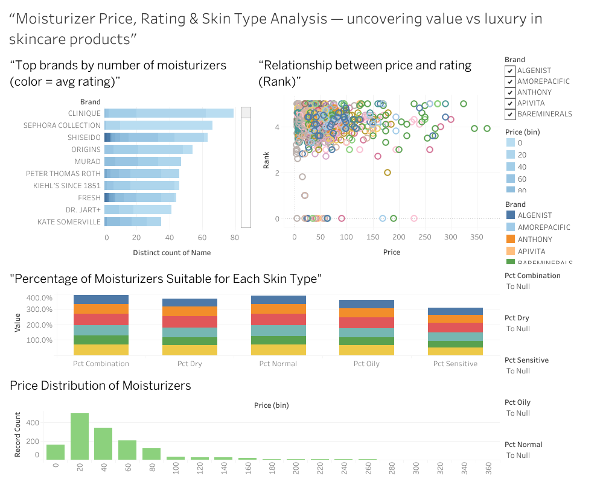

# Project3
# Sephora skincare Price, Rating and Skin Type Analysis

## Uncovering value vs. luxury in skincare products using Tableau

# This project explores the Sephora moisturizer market by analyzing more than 300 products across multiple brands.
The goal is to understand how price, customer ratings, skin-type suitability, and brand assortment influence consumer behavior and product positioning.

  

## Project Overview

Using Tableau Public, I built an interactive dashboard that highlights:

1️⃣ Top Brands by Number of Moisturizers

Shows which brands dominate product variety, with color encoding to display average customer rating.

2️⃣ Price vs. Rating Relationship

A scatter plot revealing whether higher-priced moisturizers actually deliver higher customer satisfaction.

3️⃣ Skin-Type Suitability Distribution

Percentage breakdown showing how many moisturizers are made for:

Combination

Dry

Normal

Oily

Sensitive

4️⃣ Overall Price Distribution

Histogram showing affordability clusters vs. luxury outliers.

# Key Insights

✔ Popular brands like Clinique, Sephora Collection, Shiseido, and Origins carry the largest assortment of moisturizers.
✔ There is no strong correlation between price and rating — expensive does NOT always mean better.
✔ Most moisturizers cater to Combination and Dry skin, while Sensitive skin is underrepresented.
✔ The majority of products fall within the $20–$80 range, with luxury products priced well above $200.

# Tableau Dashboard: 

 
